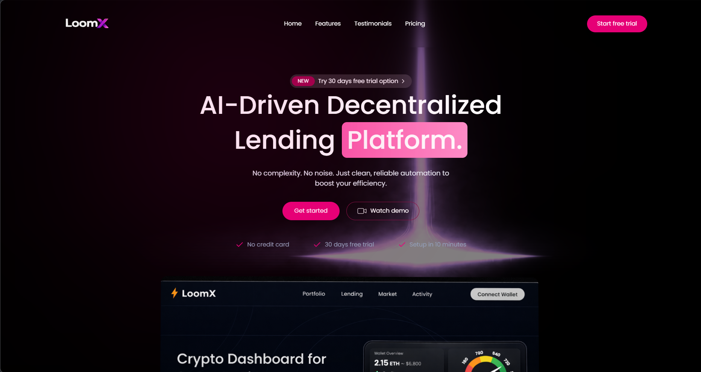
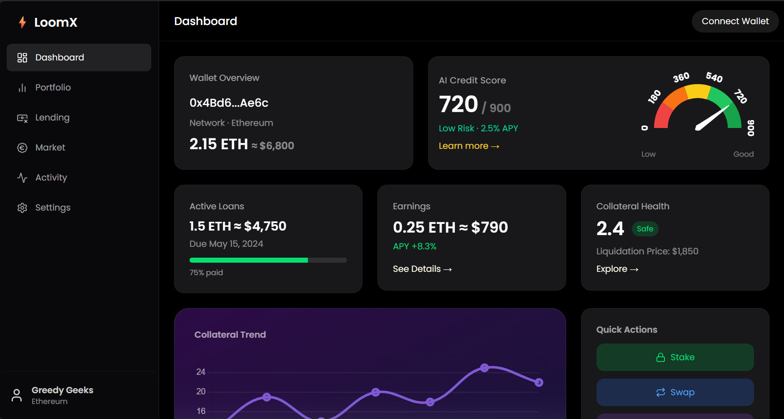

# ⛓️LoomX – AI-Driven Decentralized Lending & Credit Scoring Platform

LoomX is a full-stack application that evaluates loan applications using an AI model (XGBoost), backend APIs, and a modern React frontend.



**Dashboard***



---

## 🧠 Tech Stack

### 🔹 Frontend

* React (Vite)
* Tailwind CSS
* Axios

### 🔹 Backend

* Node.js
* Express.js
* MongoDB (Mongoose)

### 🔹 AI Service

* Python (Flask)
* XGBoost Model

---

## 📁 Project Structure

```
LoomX/
│
├── client/        # React Frontend (Vite)
├── server/        # Node.js Backend
├── AI/            # Flask + XGBoost Model
└── README.md
```

---

## ⚙️ Setup Instructions

### 1️⃣ Clone the Repository

```bash
git clone <your-repo-url>
cd LoomX
```

---

## 🧪 Step 1: Start AI Server (Flask)

```bash
cd AI
conda activate venv/
python app.py
```

✅ Runs on:

```
http://127.0.0.1:5000
```

---

## 🌐 Step 2: Start Backend Server

```bash
cd server
npm install
npm run dev
```

✅ Runs on:

```
http://localhost:5001
```

---

## 🎨 Step 3: Start Frontend

```bash
cd client
npm install
npm run dev
```

✅ Runs on:

```
http://localhost:5173
```

---

## 🔗 API Flow

1. User submits loan application (Frontend)
2. Backend stores loan in MongoDB
3. Backend calls AI Flask API:

   ```
   POST /api/ai/predict
   ```

4. AI returns:

   ```json
   {
     "eligible": true,
     "score": 750,
     "risk": "LOW"
   }
   ```

5. Backend updates loan status:

   * ✅ approved
   * ❌ rejected

---

## 🧠 AI Model Info

* Model: XGBoost Classifier
* Output:

  * Probability score
  * Risk level (LOW / MEDIUM / HIGH)
  * Eligibility decision

---

## ⚠️ Important Notes

* Make sure all 3 services are running simultaneously:

  * Flask → 5000
  * Backend → 5001
  * Frontend → 5173

* If ports conflict, update `.env` files accordingly.

---

## 🐛 Common Issues & Fixes

### Model Warning (XGBoost)

```
UserWarning: loading serialized model from older version
```

👉 Fix:

* Re-save model using:

```python
model.save_model("model.json")
```

---

### API Not Working

* Check Flask server is running
* Verify URL:

```
http://127.0.0.1:5000/api/ai/predict
```

---

### Always Rejected Issue

👉 Ensure backend uses:

```js
loan.status = eligible ? "approved" : "rejected";
```

---

## 🚀 Future Improvements

* 📊 Show AI explanation in UI
* 📈 Add confidence score visualization
* 🔐 User authentication system
* ⛓ Blockchain-based loan approval

---

## 👨‍💻 Author

Passionate Full Stack Development 🚀  
**Mini Project Team**

1. Prashanth
2. Preethika
3. Arun
4. Sathvik

---

## ⭐ Support

If you like this project, give it a ⭐ on GitHub!
